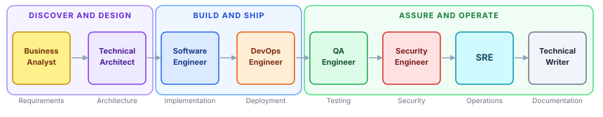
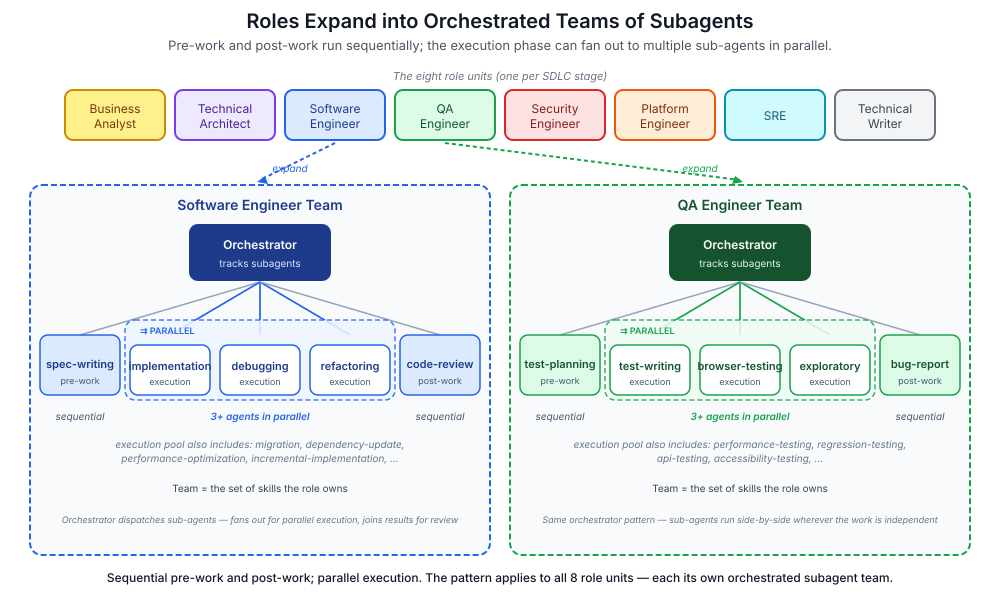

# Software Engineering Agent Team

A tool-agnostic stack of AI agents that simulate a full software engineering organization across the SDLC: **requirements → architecture → implementation → testing → security → deployment → operations → documentation**.



The project is built from the **organization** outward — first identifying the role areas a software org actually has, then forming teams of skills around each role, then backing each skill with a focused micro-agent, then placing an orchestrator over each team so the work coordinates itself.

## The Five Layers

| Layer | What it represents | Lives in |
|---|---|---|
| **1. Roles** | Areas of responsibility in a software organization. Eight scopes, no overlap, full SDLC coverage. | [roles/](roles/) |
| **2. Skill Teams** | The work each role does, expressed as a team of skills. A role's team is *defined by its skills*. | [agents/&lt;role&gt;/SKILLS.md](agents/) |
| **3. Micro-Agents** | One agent per skill, each with narrow context tuned to that skill alone. No skill agent carries knowledge beyond its slice. | [skills/&lt;role&gt;/&lt;skill&gt;.md](skills/) |
| **4. Orchestrators** | One orchestrator agent per role. Holds the role's behavioral rules; dispatches the right micro-agent for the task; keeps track of subagents. | [agents/&lt;role&gt;/agent.md](agents/) |
| **5. Adapters** | Tool-specific bindings. Map the role / orchestrator / skill structure to Claude Code, Copilot, Cursor, etc. — no content of their own. | [adapters/](adapters/) |

### Layer 1 — Roles: the organizational map

We start by identifying the main role areas in a software org. Not job titles, not teams in the HR sense — *areas of responsibility*. Eight cover the full SDLC:

| Role | Stage owned | Charter |
|---|---|---|
| Business Analyst | requirements | [roles/business-analyst.md](roles/business-analyst.md) |
| Technical Architect | architecture | [roles/technical-architect.md](roles/technical-architect.md) |
| Software Engineer | implementation | [roles/software-engineer.md](roles/software-engineer.md) |
| QA Engineer | testing | [roles/qa-engineer.md](roles/qa-engineer.md) |
| Security Engineer | security | [roles/security-engineer.md](roles/security-engineer.md) |
| Platform Engineer | deployment | [roles/platform-engineer.md](roles/platform-engineer.md) |
| SRE | operations | [roles/sre.md](roles/sre.md) |
| Technical Writer | documentation | [roles/technical-writer.md](roles/technical-writer.md) |

Each role has a **charter** in `roles/` describing focus, primary artifacts, handoffs, and boundaries. See [docs/ROLES.md](docs/ROLES.md) for the full responsibilities matrix and [docs/SDLC.md](docs/SDLC.md) for the stage-by-stage flow.

### Layer 2 — Skill Teams: roles defined by what they do

Once we know the roles, we form a **team around each one** — and a team is identified by its *skills*, not its headcount. A Software Engineer's team is `spec-writing + incremental-implementation + debugging + refactoring + code-review + ...`. A QA Engineer's team is `test-planning + test-writing + exploratory-testing + bug-report + ...`.

Each role's skill set is indexed in [`agents/<role>/SKILLS.md`](agents/), organised by the three phases every role operates in:

| Phase | What happens |
|---|---|
| Pre-work | Clarify and plan before producing the primary deliverable |
| Execution | Produce the deliverable against the pre-work plan |
| Post-work | Verify the deliverable; surface gaps before declaring done |

Skills are either **atomic** (one phase, one responsibility) or **composite** (chain atomics across phases into an end-to-end workflow).

### Layer 3 — Micro-Agents: one agent per skill, narrow context

Each skill is backed by a **micro-agent** with a micro-context: it knows how to do its skill and nothing else. A `spec-writing` agent doesn't know how to debug; a `bug-report` agent doesn't know how to threat-model. This is deliberate.

Why narrow:
- **Focus.** Smaller context → tighter reasoning, less drift, fewer hallucinations.
- **Composability.** Skills combine into composite workflows without each agent carrying baggage from others.
- **Replaceability.** A skill agent can be improved or swapped without touching the role.

Micro-agents live in [`skills/<role>/<skill>.md`](skills/) — one file per skill.

### Layer 4 — Orchestrators: a coordinator per role

Each role gets an **orchestrator agent** at [`agents/<role>/agent.md`](agents/). The orchestrator:

- Holds the role's behavioral rules (the standing rules that bound every task in this role)
- Defines the role's three-phase workflow with gates between phases
- Reads the role's `SKILLS.md` and dispatches the right micro-agent for the task at hand
- Keeps track of subagents in flight, the artifacts they produce, and the gate state between phases

The orchestrator is the entry point for a role. It does not execute skills itself — it routes work to the micro-agents in its team and validates the output before passing the work on.

### Layer 5 — Adapters: tool-specific bindings

The first four layers are tool-agnostic. The fifth layer maps them into each AI coding tool's native format:

- **Claude Code** — `.claude/agents/*.md` with YAML frontmatter, imports via `@path/to/file`
- **GitHub Copilot** — `.github/` chat participants (planned)
- **Cursor** — `.cursor/rules/*.md` (planned)

Adapters contain no content of their own. They are thin: each adapter file imports the role's orchestrator, its skill index, and any guidelines, then declares which tools (bash, web search, file reads) the orchestrator may invoke.

Start with [adapters/claude/GETTING-STARTED.md](adapters/claude/GETTING-STARTED.md).

## From Roles to Org Units

So far each role has been described as a single area of responsibility. In a real organization, each of those eight roles is *not just a role* — it is a **unit, a team, or a department**: a Business Analysis group, an Architecture practice, an Engineering team, a QA team, a Security team, a Platform team, an SRE team, a Documentation team.

The orchestrator pattern in Layer 4 isn't an implementation detail — it is what lets the same architecture model a single role *or* a whole department. The orchestrator plays the part of the team lead; the skill-specific micro-agents are the team's specialists. Adding a new specialist to the team is adding a new micro-agent. Replacing one is swapping a single skill file.



### Sequential pre-work and post-work, parallel execution

Once a role is modelled as a team, the three-phase workflow becomes a real concurrency contract — not just a conceptual one:

| Phase | Concurrency | Why |
|---|---|---|
| **Pre-work** | Sequential, single agent | The role must converge on *one* spec, plan, or threat model before execution starts. Two parallel pre-work agents would produce two contradictory plans. |
| **Execution** | **Parallel — multiple sub-agents run concurrently** | The deliverable is naturally divisible (independent code paths, separate test suites, independent vulnerability classes). The orchestrator fans out to as many sub-agents as the work has independent slices. |
| **Post-work** | Sequential, single agent | The role must produce *one* verdict, review, or sign-off that aggregates the parallel output. Two post-work agents would produce two conflicting verdicts. |

Concrete examples — for a single feature, in one turn:

- **Software Engineer team** — orchestrator dispatches `spec-writing` first. Then runs `incremental-implementation`, `debugging`, and `refactoring` in parallel across three independent files or modules. Then runs `code-review` once to verify the merged output.
- **QA Engineer team** — orchestrator dispatches `test-planning` first. Then runs `test-writing`, `browser-testing`, and `exploratory-testing` in parallel against the same build. Then runs `bug-report` once to consolidate findings into a single verdict.
- **Security Engineer team** — orchestrator dispatches `threat-modeling` first. Then runs `security-audit`, `vulnerability-assessment`, and `dependency-vulnerability` in parallel — each is a different attack surface. Then runs `compliance-review` once to deliver the consolidated risk picture.

### The same pattern in every unit

This is how the system scales:

| Concept | In one role | In the organization |
|---|---|---|
| Unit | the role | the team / department |
| Lead | the orchestrator agent | the orchestrator agent (same pattern) |
| Specialists | skill micro-agents | skill micro-agents (one per capability) |
| Definition of the team | the role's `SKILLS.md` | the team's `SKILLS.md` |
| Growth | add a skill file | add a skill file |
| Throughput | one task at a time | parallel sub-agents inside execution |

The same pattern applies to all eight role units. Each unit owns its own orchestrator, its own set of skill micro-agents, and its own slice of the SDLC — and inside each unit, the orchestrator decides how many sub-agents to fan out during execution based on how many independent work-streams the task contains. Editable source for the diagram: [docs/diagrams/role-team-expansion.excalidraw](docs/diagrams/role-team-expansion.excalidraw).

## How a Task Flows Through the Layers

A concrete example — "ship a feature":

```
Layer 5 ─ Claude Code adapter invokes the software-engineer orchestrator
Layer 4 ─ Orchestrator reads the task, applies behavioral rules, picks the composite skill `ship-feature`
Layer 3 ─ `ship-feature` chains micro-agents: spec-writing → incremental-implementation → code-review
Layer 2 ─ Each micro-agent operates within the software-engineer skill team
Layer 1 ─ The software-engineer role owns the implementation stage; output hands off to QA Engineer
```

Each layer enforces a constraint the next layer relies on. Skip a layer and the work loses either coordination (no orchestrator) or focus (no micro-context).

## Repository Layout

```
se-agent-team/
├── README.md              ← this file (the only file outside folders)
├── roles/                 ← Layer 1: role charters
│   └── <role>.md
├── agents/                ← Layer 4: orchestrators
│   └── <role>/
│       ├── agent.md       ← orchestrator definition (behavioral rules + workflow)
│       └── SKILLS.md      ← Layer 2: the role's skill team index
├── skills/                ← Layer 3: micro-agents
│   └── <role>/
│       └── <skill>.md     ← one micro-agent per skill
├── adapters/              ← Layer 5: tool bindings
│   └── claude/
│       ├── <role>.md      ← per-role adapter
│       ├── SPEC.md
│       ├── MCP.md
│       └── examples/
└── docs/
    ├── ROLES.md           ← responsibilities matrix
    ├── SDLC.md            ← stage-by-stage flow
    └── diagrams/
```

## Principles

- **Org-first, tool-last.** Identify the roles in a real software org before designing any agent. Tool adapters come last.
- **Skills define teams.** A role's team is the set of skills it owns — not a head-count.
- **Micro-context per skill.** Each skill agent knows its skill and nothing else. Narrow agents reason better.
- **Orchestrator per role.** One coordinator per role keeps track of its subagents, gates between phases, and the role's artifacts.
- **Full SDLC coverage.** Every stage from requirements to documentation has an owning role.
- **No content in adapters.** Adapters import from the core layers; updating a skill or orchestrator reflects everywhere.

## License

Apache 2.0
